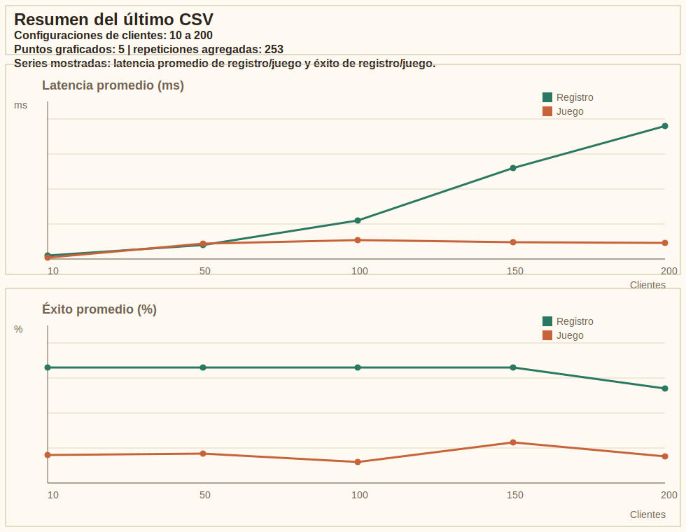

# Reporte del Proyecto Alpha

## Contexto Breve

Alpha es un juego distribuido en Java, "Pégale al monstruo", donde varios clientes compiten por golpear un monstruo en un tablero compartido. El sistema combina `TCP` para las operaciones críticas y `JMS` con ActiveMQ embebido para difundir monstruos, eventos globales, ganador y reinicio de partida.

El componente central de este reporte es el estresador experimental del proyecto, porque ahí se concentra la evaluación de desempeño pedida en el PDF.

## Objetivo Del Experimento

El objetivo del estresador es medir cómo responde el sistema cuando aumenta la cantidad de clientes concurrentes y cómo cambia el desempeño del registro y del juego bajo carga. En concreto, busca responder estas preguntas:

- cuánto tarda el registro/login cuando hay más clientes en paralelo,
- cuánta variabilidad presentan esos tiempos,
- qué porcentaje de registros y golpes se resuelven con éxito,
- cómo se degrada el desempeño del juego conforme crece la contención entre clientes.

La herramienta está pensada para generar resultados repetibles y exportables a CSV, de manera que el análisis pueda incluirse en un documento académico o en una entrega de GitHub.

## Arquitectura Del Estresador

El estresador se organiza en tres piezas:

- `StressTestMain`
  - coordina cada corrida,
  - lee parámetros por línea de comandos,
  - crea el archivo CSV,
  - lanza lotes de clientes para distintas configuraciones,
  - agrega los resultados por repetición.

- `StressClientWorker`
  - simula un cliente completo,
  - registra un usuario,
  - inicia sesión,
  - consulta el estado del juego,
  - intenta golpes repetidos sobre el monstruo activo,
  - reporta tiempos y éxitos individuales.

- `StressSummary`
  - agrega los resultados de todos los workers,
  - calcula promedio, desviación estándar y porcentajes de éxito,
  - deja una salida compacta lista para el CSV.

El flujo general es:

1. `StressTestMain` define cantidades de clientes, número de golpes, repeticiones y ruta de salida.
2. Para cada configuración, crea varios `StressClientWorker` en un `ExecutorService`.
3. Cada worker usa una conexión TCP independiente y mide tiempos con `System.nanoTime()`.
4. `StressSummary` consolida los resultados y produce métricas agregadas.
5. El estresador escribe una fila por repetición en CSV.

## Implementación

### `StressTestMain`

`StressTestMain` es el orquestador. Sus decisiones principales son:

- usa `AppConfig` como base y permite sobrescribir parámetros por argumentos como `--clients`, `--hits`, `--repetitions`, `--thinkTimeMs` y `--output`,
- toma por defecto `samples/stress-results.csv` como archivo de salida,
- escribe una cabecera CSV si el archivo no existe,
- recorre listas de clientes como `10,50,100`,
- ejecuta varias repeticiones por configuración,
- formatea las métricas con dos decimales para facilitar el análisis posterior.

La salida que genera por fila incluye:

- `timestamp`,
- `clients`,
- `repetition`,
- `register_avg_ms`,
- `register_stddev_ms`,
- `register_success_pct`,
- `game_avg_ms`,
- `game_stddev_ms`,
- `game_success_pct`.

### `StressClientWorker`

Cada worker representa un cliente sintético. Su lógica es importante porque no solo mide, también ejecuta el mismo flujo funcional de un jugador real:

- abre una conexión TCP para el registro,
- mide el tiempo de `REGISTER`,
- guarda si el registro fue aceptado,
- si todo va bien, hace `LOGOUT` de esa primera sesión,
- abre una nueva conexión para jugar,
- realiza `LOGIN`,
- consulta `GAME_STATE` antes de cada intento de golpe,
- cuando hay un monstruo visible, envía `HIT` con fila, columna y `monsterId`,
- mide el tiempo del golpe y registra si fue exitoso,
- realiza una pausa corta con `thinkTimeMs` para modelar un usuario real.

Ese diseño hace que el estresador no sea un simple benchmark artificial de red, sino una ejecución funcional del sistema bajo carga.

### `StressSummary`

`StressSummary` consolida el trabajo de todos los clientes de una configuración. En concreto:

- acumula tiempos de registro,
- acumula tiempos de golpe,
- cuenta registros exitosos,
- cuenta golpes exitosos,
- calcula promedio y desviación estándar usando `StatsUtils`,
- calcula porcentajes de éxito sobre el total observado.

La decisión de separar la medición por worker y la agregación en otra clase facilita interpretar el resultado por repetición y evita mezclar lógica de ejecución con estadística.

## Métricas Del CSV

El CSV producido por el estresador mide tres aspectos principales del sistema.

### Registro

- `register_avg_ms`: tiempo promedio de registro/login.
- `register_stddev_ms`: dispersión de esos tiempos.
- `register_success_pct`: porcentaje de registros aceptados.

### Juego

- `game_avg_ms`: tiempo promedio de respuesta al golpe.
- `game_stddev_ms`: dispersión de los tiempos de golpe.
- `game_success_pct`: porcentaje de golpes que el servidor aceptó como válidos.

### Qué Significa Cada Métrica

- Un promedio más alto suele indicar mayor carga o más trabajo de validación.
- Una desviación estándar alta indica comportamiento menos estable entre clientes o repeticiones.
- Un porcentaje de éxito bajo en registro apunta a problemas de disponibilidad, colisiones de nombres o fallas de conexión.
- Un porcentaje de éxito bajo en juego suele relacionarse con contención por el monstruo activo, golpes fuera de tiempo o sincronización tardía entre clientes.

## Cómo Interpretar Los Resultados

El estresador debe leerse junto con el comportamiento del juego:

- Si aumenta `register_avg_ms` cuando sube la cantidad de clientes, el servidor está mostrando el costo natural de atender más conexiones concurrentes.
- Si `register_stddev_ms` crece, el sistema se vuelve menos homogéneo entre clientes y aparecen más diferencias entre sesiones.
- Si `game_avg_ms` sube con más clientes, la contención sobre el monstruo y la coordinación TCP/JMS están afectando la rapidez de respuesta.
- Si `game_success_pct` baja, muchos intentos de golpe están ocurriendo fuera de la ventana útil del monstruo o con conflictos entre clientes.

En otras palabras, el CSV no solo dice si el sistema "funciona", sino qué tanto se degrada al aumentar la concurrencia.

## Análisis Del CSV Incluido

El repositorio incluye una muestra en [`samples/stress-results-example.csv`](../samples/stress-results-example.csv). Esa muestra contiene tres configuraciones: 10, 50 y 100 clientes.

La tendencia observada es coherente con un sistema concurrente sometido a mayor carga:

- el registro empeora progresivamente de `14.20 ms` a `31.70 ms` y luego a `52.10 ms`,
- la desviación estándar del registro también crece de `2.85` a `6.10` y `12.35`,
- el porcentaje de registro exitoso se mantiene alto, aunque cae ligeramente en la carga más alta: `100%`, `100%`, `99%`,
- el tiempo promedio de juego sube de `4.90 ms` a `8.40 ms` y `13.70 ms`,
- la dispersión del juego también aumenta: `1.60`, `3.45`, `5.80`,
- el porcentaje de éxito del juego cae con más fuerza: `87.0%`, `79.2%`, `72.4%`.

La lectura razonable de estos datos es la siguiente:

- el subsistema de registro soporta bien la carga baja y media, pero ya muestra aumento de latencia en la configuración más pesada,
- el juego es más sensible a la concurrencia porque depende del momento exacto en que el monstruo está visible,
- la caída de éxito en golpes no necesariamente implica error de lógica; puede reflejar una ventana de juego corta frente a la cantidad de clientes compitiendo,
- el aumento de la variabilidad sugiere contención entre clientes y efectos de sincronización esperables en un sistema distribuido.

Como solo existe un CSV de ejemplo comprometido en el repositorio, esta sección debe entenderse como un análisis representativo. Las corridas reales generadas por `StressTestMain` se escriben en `samples/stress-results.csv` u otra ruta indicada por parámetro.

## Gráfica Del Último CSV

La siguiente imagen resume visualmente el último CSV de estrés y sirve como apoyo para interpretar tendencia, dispersión y éxito del sistema bajo carga.

## Archivos Y Salidas Del Estresador

- `samples/stress-results-example.csv`
  - muestra de resultados para documentación y comparación rápida.
- `samples/stress-results.csv`
  - salida por defecto de una corrida real si no se sobreescribe `--output`.
- `samples/generated/stress-results.csv`
  - ruta usada por la interfaz del servidor para las corridas lanzadas desde la aplicación.

Cada fila adicional en esos archivos representa una repetición concreta de una configuración de clientes.

## Contexto Del Sistema General

Aunque este reporte se centra en el estresador, el sistema completo sigue esta estructura:

- `GameServerMain` inicia el servidor.
- `AlphaServerRuntime` ensambla broker, motor de juego y TCP.
- `GameEngine` coordina monstruos, golpes, ganador y reinicio.
- `GameClientMain` inicia el cliente Swing.
- `GameClientController` conecta la UI con TCP y JMS.
- `PlayerRegistry` preserva sesiones y puntajes mientras el servidor siga activo.

## Entregables Actuales

- código fuente completo,
- ejecutables lógicos para servidor, cliente y estrés,
- CSV de ejemplo para la evaluación,
- salida real de estrés en CSV,
- documentación principal en `README.md`,
- este reporte en `docs/reporte-proyecto.md`.

## Cierre

El valor principal del proyecto no es solo que el juego funcione, sino que también puede medirse bajo carga. El estresador convierte la ejecución en evidencia experimental: produce métricas, permite comparar configuraciones y deja un rastro en CSV que puede incluirse en GitHub o en el documento final del proyecto.
